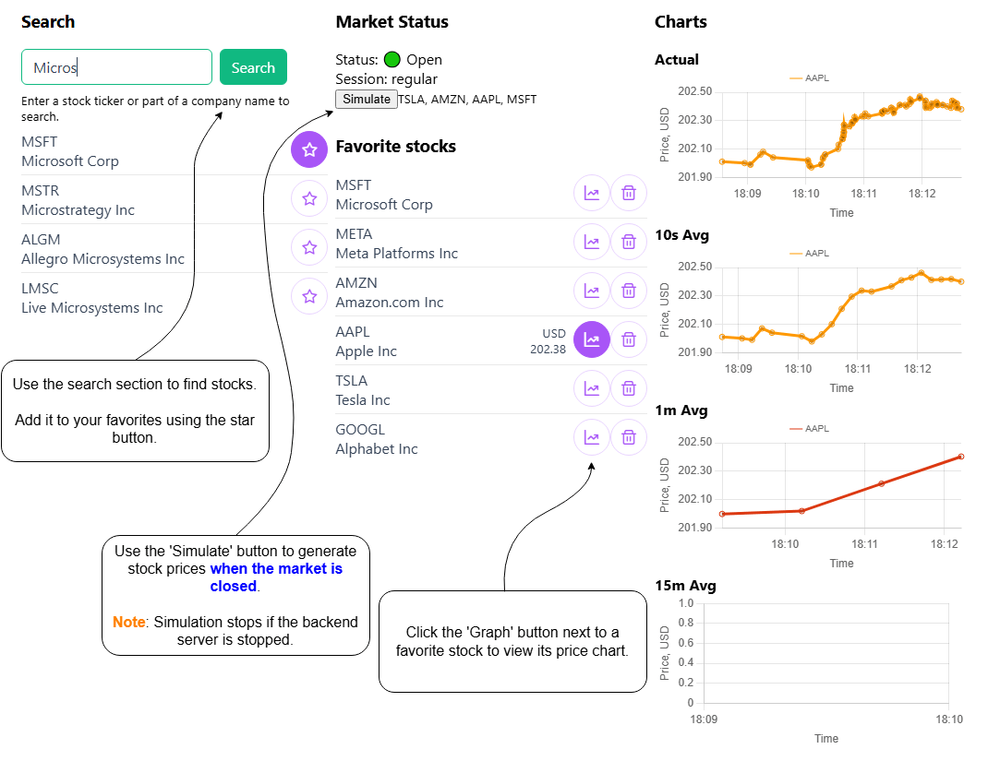

# MR Fullstack Project

This is a fullstack monorepo project containing both frontend and backend parts, structured for modular development and containerized deployment.

## Project Structure

mr/<br>
├── mr-frontend/ # Angular frontend<br>
├── mr-backend/ # NestJS backend<br>
├── docker-compose.yml<br>

Quick Start (with Docker Compose)
```bash
docker compose up --build
```

The application will be available at:<br>
Frontend: http://localhost:8080<br>
Backend API: http://localhost:3000<br>

